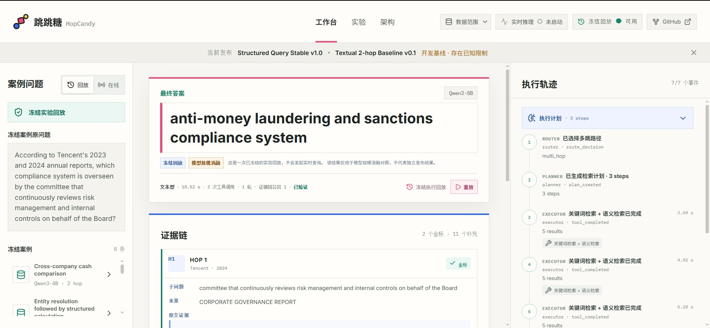
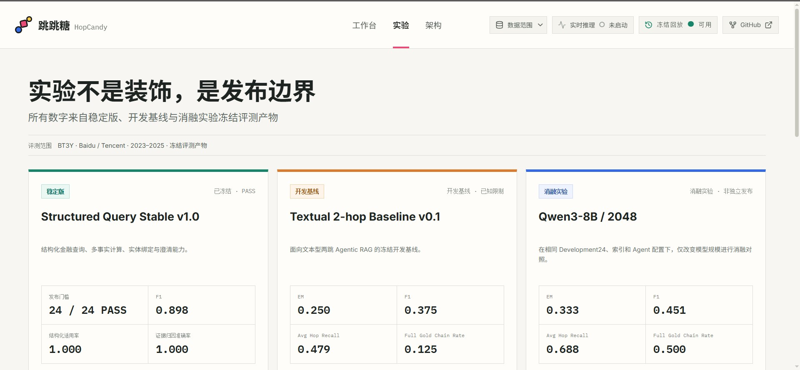
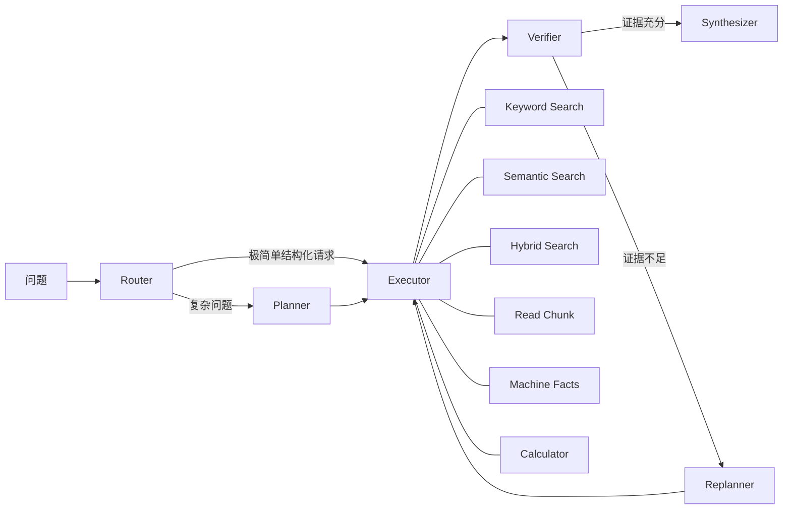
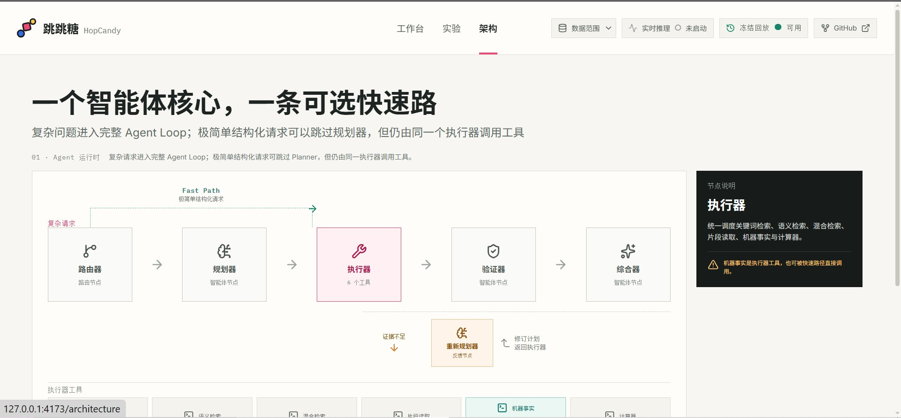

<div align="center">
  
  <h1>HopCandy · 跳跳糖</h1>
  <p><strong>面向金融年报多跳问答的可观测 Agentic RAG 工作台</strong></p>
  <p>把答案、证据链、规划、工具调用与能力边界放在同一个可检查界面中。</p>
  <p>
    
    
    
    
    
    
  </p>
  <p>
    <a href="https://hopcandy-agentic-rag.vercel.app/">在线演示</a>
    ·
    <a href="https://github.com/chenzhao-labs/hopcandy-agentic-rag">GitHub 源码</a>
  </p>
</div>

> **在线演示：** [hopcandy-agentic-rag.vercel.app](https://hopcandy-agentic-rag.vercel.app/)，当前以冻结 Bundled JSON 提供 Replay 工作台。

---

## 项目元数据

| 维度 | 当前状态 |
| --- | --- |
| 项目形态 | 可运行、可评测、可复现、可展示的 Agentic RAG Baseline |
| 公开数据 | 脱敏冻结 Replay、实验摘要、API Contract 与部署制品 |
| 当前部署 | GitHub 源码 + Vercel 静态前端；Supabase 暂不连接 |
| 在线模式 | Replay 始终可用；Live Agent 默认关闭、按需接入 GPU |
| 核心模型 | Qwen3-4B，`max_output_tokens=2048` |
| 本地资源 | 紧凑模型可在 CPU 环境运行；GPU 不是体验 Replay 的前提 |
| 数据范围 | 百度、腾讯 2023—2025 年六份年报 |
| 许可证 | MIT |

## 能力状态

```text
Structured Query Stable v1.0
+
Textual 2-hop Baseline v0.1（Development，存在已知限制）
```

**Replay-first MVP 已完成。** 当前版本已打通真实冻结结果、稳定展示契约、查询工作台、证据链、Agent 执行轨迹、实验对照、Backend Adapter 与公开发布数据层。本轮 Vercel 部署不连接 Supabase 或 GPU，直接使用仓库内冻结数据完成回放演示。

MVP 完成不代表所有文本多跳问题已经稳定解决，也不代表公网 Live Agent 已经常驻上线。项目保留真实失败、弃答、Replan、成本与能力边界，不用回放结果伪装实时推理。



## 模型与运行资源

文本两跳 Baseline 使用 **Qwen3-4B**，输出上限固定为 `2048`。选择紧凑模型的目的，是让完整
Agent 在不依赖高端 GPU 的条件下也能运行；CPU 运行可行，但推理速度会更低。

这也是项目保留 Textual 2-hop 为 Development Baseline 的原因之一：相比同配置下的 Qwen3-8B
消融，4B 在完整两跳证据链覆盖上存在明显限制。8B 结果只用于诊断模型规模影响，不替换 4B
Baseline，也不被描述为独立 Stable Release。公开 Vercel 站点始终使用冻结 Replay，不在浏览器
或 Vercel Function 中加载模型。

## 项目解决什么问题

传统 RAG 往往只展示最终答案，很难回答以下工程问题：

- 系统为什么选择这条检索路径？
- Planner 如何拆分多跳问题？
- 每一步调用了什么工具、找到了哪些证据？
- Verifier 为什么判定证据充分或不足？
- Replanner 是否真正改变了检索策略？
- 答案中的数字和结论能否回溯到原文或确定性计算？

跳跳糖把这些中间状态转化为可检查的工作台：左侧选择问题与运行模式，中间展示答案和 Evidence Chain，右侧展示 Router、Planner、Executor、Verifier、Replanner、Synthesizer 的完整事件轨迹。

## MVP 已完成内容

- 三栏查询工作台：问题、答案、证据链、执行轨迹同屏展示。
- 8 个真实冻结 Replay：覆盖结构化计算、文本两跳、实体绑定、澄清、Replan、弃答和模型对照。
- 稳定的 `hopcandy-api-v1`：统一 Replay 与 Live 响应结构。
- Replay / Live 双态：Replay 始终可用，Live Agent 默认关闭并按需接入 GPU。
- 版本化发布数据：当前使用 Bundled JSON；后续可选接入 Supabase 发布表。
- 数据一致性检查：未来启用 Supabase 后，行数或 Fixture Hash 不匹配时自动回退本地快照。
- 实验页：明确区分 Stable、Development Baseline 与 Ablation。
- 架构页：展示一个 Agentic RAG 核心与一条可选 Structured Fast Path。
- Backend 防护：服务间 Token、CORS、输入长度、单并发、超时与错误清洗。
- 公开发布审计：Allowlist、SHA256 Manifest、Secret/路径/大文件检查与 GitHub Actions。
- 桌面端与移动端适配：移动端在答案、证据和轨迹之间切换，无横向溢出。

## 真实数据与回放边界

网页展示的不是手写演示答案。公开数据来自已经冻结的真实 Agent 运行和正式评测结果：

```text
冻结评测结果 / Agent State
        ↓
Trace Adapter（字段归一化与敏感信息清洗）
        ↓
hopcandy-api-v1 Replay Responses
        ↓
Bundled JSON（当前 Vercel 部署；后续可选版本匹配的 Supabase Published Rows）
        ↓
答案 / Evidence Chain / Plan / Agent Timeline
```

前端当前读取：

- `demo_cases.json`：8 个冻结真实案例及其答案、证据、Plan 和 Agent Trace；
- `experiments.json`：3 组冻结实验结果；
- `publication_manifest.json`：Fixture、API Contract 和发布数据版本及 Hash。

Replay 会清楚标记为“冻结实验回放”，不会发起模型请求。只有启用 Live Feature Flag 且受保护 Backend 健康检查通过时，新问题才会调用真实 Agent。

当前网站不配置 `VITE_SUPABASE_URL` 或 `VITE_SUPABASE_PUBLISHABLE_KEY`，因此始终读取 Bundled JSON。后续接入登录、用户数据或远端发布数据时，再启用 Supabase。

## 数据范围

| 项目 | 当前范围 |
| --- | --- |
| 公司 | 百度、腾讯 |
| 年份 | 2023、2024、2025 |
| 年报 | 6 份 |
| 私有研究语料 | 14,077 Chunks |
| 公开仓库 | 脱敏 Replay、契约、测试与部署制品 |

完整年报、全量 Chunks、索引、Embedding 模型和实验原始结果不进入公开仓库。它们只属于私有研究与按需 GPU 运行环境。

## 当前冻结结果

### Structured Query Stable v1.0

适用范围是百度、腾讯 2023—2025 年已登记财务指标的查询、单位转换、多事实比较与确定性计算。

| 指标 | 结果 |
| --- | ---: |
| 独立 Structured Test v3 | 24 题 |
| 系统错误 | 0 |
| Overall / 1-hop / 2-hop / 3-hop Hop Recall | 1.000 |
| Structured Apply | 1.000 |
| Numeric / Unit / Calculation / Completeness / Grounding | 1.000 |
| F1 | 0.898 |
| EM | 0.375 |

这里的 1/2/3-hop 指结构化事实数量或确定性操作链，不能外推为通用文本型 3-hop 已稳定。

### Textual 2-hop Baseline v0.1

这是 Development24 上冻结的开发基线，用于暴露真实的检索、证据覆盖和端到端推理问题，不是独立 Test 或 Stable Release。

| 指标 | Qwen3-4B / 2048 |
| --- | ---: |
| Samples / System Errors | 24 / 0 |
| EM | 0.250 |
| F1 | 0.375 |
| Average Hop Recall | 0.479 |
| Full Gold Chain Rate | 0.125 |
| Trace Complete Rate | 1.000 |

Qwen3-8B 消融实验在同一 Development24 上将 Average Hop Recall 提高到 `0.688`、Full Gold Chain Rate 提高到 `0.500`，但 P50 延迟约为 4B 的 `6.661×`。该结果用于分析模型规模影响，不替换 4B Baseline，也不升级为 Stable。



## 系统架构

系统只有一个 Agentic RAG 核心。`Machine Facts` 是 Executor 的工具之一，不是与多跳 RAG 平行的第二套系统；Structured Fast Path 只是极简单结构化请求的低风险优化。





公开部署边界：

```text
GitHub       公开源码、脱敏 Fixtures、测试与部署配置
Vercel       React/Vite 工作台，Replay 始终可访问
Supabase     当前不连接；保留 Schema、RLS 与 Seed，供后续登录/持久化阶段启用
GPU Backend  按需启动真实 Agent，不作为 Replay 可用性的前提
```

Supabase 不承担向量检索、模型推理或 Agent 编排；Vercel Function 也不加载 Python RAG 运行时。

## 仓库结构

```text
hopcandy-agentic-rag/
├── hopcandy/
│   ├── backend/          # FastAPI Adapter、运行时防护、Trace 归一化
│   ├── contracts/        # hopcandy-api-v1 Schema 与冻结 Contract Lock
│   ├── fixtures/         # 脱敏冻结 Replay 制品
│   ├── frontend/         # React 19 + TypeScript + Vite 工作台
│   ├── public_data/      # 版本化发布数据与 Manifest
│   └── supabase/         # Migration、RLS 与 Seed
├── tests/                # Adapter、Backend 和公开发布契约测试
├── scripts/              # 公开仓库安全审计
├── PUBLIC_RELEASE_MANIFEST.json
└── README.md
```

## 本地运行

### 只运行前端 Replay

需要 Node.js 20+：

```bash
cd hopcandy/frontend
npm ci
npm run dev
```

默认配置不依赖 Supabase 或 GPU。访问终端输出中的本地地址即可浏览工作台、实验和架构页面。

### 当前 Vercel 部署

在 Vercel 导入 GitHub 仓库时，设置：

```text
Root Directory: hopcandy/frontend
Framework Preset: Vite
Install Command: npm ci
Build Command: npm run build
Output Directory: dist
```

`hopcandy/frontend/vercel.json` 已为 React 单页路由配置 rewrite，因此直接访问或刷新
`/experiments`、`/architecture` 也会返回前端入口。当前不配置任何 Supabase 环境变量，
并将 `VITE_HOPCANDY_LIVE_ENABLED=false`。

### 前端环境变量

复制 `hopcandy/frontend/.env.example`，按需配置：

```text
VITE_HOPCANDY_LIVE_ENABLED=false
VITE_SUPABASE_URL=
VITE_SUPABASE_PUBLISHABLE_KEY=
VITE_PUBLIC_REPOSITORY_URL=
```

`VITE_*` 会进入浏览器 Bundle，只能填写公开值。Supabase Secret Key、Backend Token 和 GPU 地址不得使用 `VITE_` 前缀。

当前 Vercel 首发只需要保持 `VITE_HOPCANDY_LIVE_ENABLED=false`；两个 `VITE_SUPABASE_*`
变量不配置即可。`VITE_PUBLIC_REPOSITORY_URL` 可按需填写公开 GitHub 仓库地址。

### 可选 Backend

需要 Python 3.11+：

```bash
python -m venv .venv
# Windows: .venv\Scripts\activate
# macOS/Linux: source .venv/bin/activate
pip install -r requirements-dev.txt
uvicorn hopcandy.backend.app:app --host 127.0.0.1 --port 8000
```

Backend 默认返回 `Replay Available / Live Offline`。公开仓库不包含真实 Live 所需的模型、索引和私有语料。

## 测试与发布审计

每次在本仓库中新增、删除、重命名或修改公开文件后，先刷新 Manifest，再运行审计和测试：

```bash
python scripts/refresh_public_release_manifest.py --root .
python scripts/validate_public_release.py --root .
python -m pytest tests/test_hopcandy_step1_contract.py tests/test_hopcandy_step3_backend.py tests/test_public_release.py

cd hopcandy/frontend
npm test
npm run build
```

文件重命名等同于“删除旧文件 + 新增新文件”。不要手工编辑 `PUBLIC_RELEASE_MANIFEST.json`；刷新脚本会保留未变制品的来源元数据，只更新新增或修改文件的哈希、文件清单与树摘要。脚本遇到 `.env`、模型、索引、`node_modules`、`dist`、PDF 或超过 2 MB 的文件会拒绝执行，避免把不应公开的文件加入发布包。

`PUBLIC_RELEASE_MANIFEST.json` 记录每个公开文件的 SHA256，并绑定 Fixture Version、Publication Version 与 API Contract Version。GitHub Actions 会重复执行安全审计、Python Contract 测试、前端单测和生产构建。

## 已知边界

- Textual 2-hop 仍是带已知限制的 Development Baseline。
- Qwen3-8B 结果是同一开发集上的模型规模消融，不是独立发布结果。
- 3-hop、知识图谱、SFT/GRPO 和公司扩展不属于当前 MVP。
- Live Agent 默认关闭；GPU 离线时网站仍完整提供 Replay。
- 当前公开页面只有工作台、实验和架构，不包含 `/engineering`。
- 当前源码与早期 Step 1 Adapter 快照存在已记录的源码漂移；兼容性由公开契约测试证明，不宣称字节级复刻。

## 许可证

MIT，详见 [LICENSE](LICENSE)。
